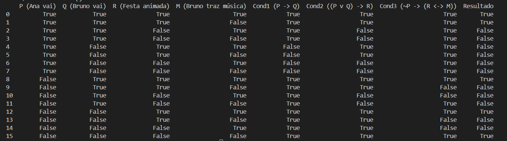
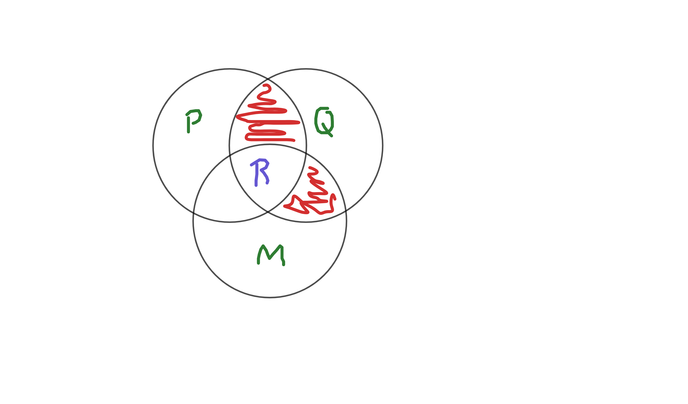

# Tabela Verdade para Análise de Lógica Proposicional

Este documento explica como construir uma tabela verdade para avaliar uma situação do cotidiano com lógica proposicional. A tabela será implementada em Python, e o código é apresentado em detalhes. 

## Parte A: Definição das Proposições e Condições

Para construir a tabela verdade manualmente, definimos as proposições e as condições com base nas instruções:

### Proposições:
- **P**: Ana vai à festa.
- **Q**: Bruno vai à festa.
- **M**: Bruno traz música.
- **R**: A festa é animada.

### Condições em forma de proposições lógicas:
1. Se Ana vai, então Bruno também vai: (P → Q)
2. Se Ana ou Bruno for, a festa é animada: ((P ∨ Q) → R)
3. Se Ana não vai, a animação da festa depende da música de Bruno: (¬P → (M → R))

## Parte B: Implementação em Python

Abaixo está o código para criar a tabela verdade automaticamente e avaliar a condição final para cada combinação das proposições.

```python
import itertools
import pandas as pd

def tabela_verdade():
    # Passo 1: Definindo valores lógicos para as combinações de P, Q e M
    valores_verdade = [True, False]
    combinacoes = list(itertools.product(valores_verdade, repeat=3))

    # Inicializando a tabela para armazenar os resultados
    tabela_resultados = []

    for P, Q, M in combinacoes:
        # Passo 2: Avaliação das proposições lógicas
        
        # Condição 1: Se Ana vai, então Bruno também vai (P → Q)
        cond1 = not P or Q
        
        # Condição 2: Se Ana ou Bruno for, a festa é animada ((P ∨ Q) → R)
        cond2 = (P or Q)  # Parte esquerda da implicação
        R = cond2  # Inicialmente assumimos que R seja verdadeiro se P ou Q for verdadeiro

        # Condição 3: Se Ana não vai, a festa depende da música de Bruno (¬P → (M → R))
        if not P:
            cond3 = not M or R  # M → R, então apenas será animada se Bruno trouxer música
            R = R if cond3 else False  # Ajustando R conforme a condição

        # Passo 3: Armazenando os resultados na tabela
        tabela_resultados.append([P, Q, M, R])

    # Exibindo a tabela em formato de DataFrame
    colunas = ["P (Ana vai)", "Q (Bruno vai)", "M (Bruno traz música)", "R (Festa animada)"]
    tabela_df = pd.DataFrame(tabela_resultados, columns=colunas)
    print(tabela_df)

# Chamada da função para exibir a tabela verdade
tabela_verdade()
```

## Parte C: Explicação da Lógica do Algoritmo

### Passo 1: Listar todas as combinações de valores para P, Q e M

Usamos `itertools.product` para gerar todas as combinações de valores verdade possíveis para as proposições P, Q e M. Cada combinação representa uma situação única onde Ana vai ou não à festa, Bruno vai ou não à festa, e Bruno traz ou não traz música.

### Passo 2: Avaliar cada proposição lógica usando operadores de Python

Para cada combinação de P, Q, e M, o algoritmo calcula o valor de R com base nas condições definidas:
- **Cond1**: P → Q (Se Ana vai, Bruno também vai).
- **Cond2**: (P ∨ Q) → R (Se Ana ou Bruno vai, a festa é animada). Aqui, assumimos que R é verdadeiro se Ana ou Bruno vão à festa.
- **Cond3**: ¬P → (M → R) (Se Ana não vai, a festa depende da música de Bruno). Quando P é falso, o valor de R depende se Bruno trouxe música ou não.

Cada uma das condições é avaliada usando operadores de lógica no Python (`or`, `not`, `==`, `<=` para implicação).

### Passo 3: Exibir a tabela verdade com resultados

Ao final, os resultados são armazenados em uma tabela (`DataFrame` do Pandas) e exibidos com os valores de P, Q, M e o respectivo valor de R para cada combinação.

Essa implementação permite avaliar a situação com precisão e exibir todos os cenários possíveis.

## Resultado Esperado

Ao rodar o programa, será exibida uma tabela que mostra cada combinação de valores para P, Q, e M e se a festa será animada (valor de R).



## Instalação das Bibliotecas Utilizadas

Para rodar o código em Python, você precisará utilizar duas bibliotecas: **itertools** (já incluída na biblioteca padrão do Python) e **pandas** (que pode precisar de instalação).

### 1. itertools
A biblioteca **itertools** faz parte da biblioteca padrão do Python, então você não precisa instalar nada adicional para usá-la. Ela fornece ferramentas para manipulação de iteradores, como a geração de combinações usada neste código.

### 2. pandas
A biblioteca **pandas** é amplamente utilizada para manipulação e análise de dados, e permite criar tabelas de dados organizadas, como DataFrames. No código, usamos pandas para estruturar e exibir a tabela verdade de forma mais legível.

Para instalar o **pandas**, execute o comando abaixo em seu terminal:

```bash
pip install pandas
```

### Verificando se as Instalações Estão Corretas
Após instalar, você pode abrir um terminal Python e tentar importar as bibliotecas para verificar se a instalação foi bem-sucedida:

```python
import itertools
import pandas as pd
```

Se não houver erros, as bibliotecas estão prontas para uso.

# Diagrama de Venn



Este diagrama de Venn ilustra a relação entre as proposições lógicas discutidas. Para interagir com o diagrama, você pode acessar a versão interativa no [GeoGebra aqui](https://www.geogebra.org/calculator/armg8qvj).

